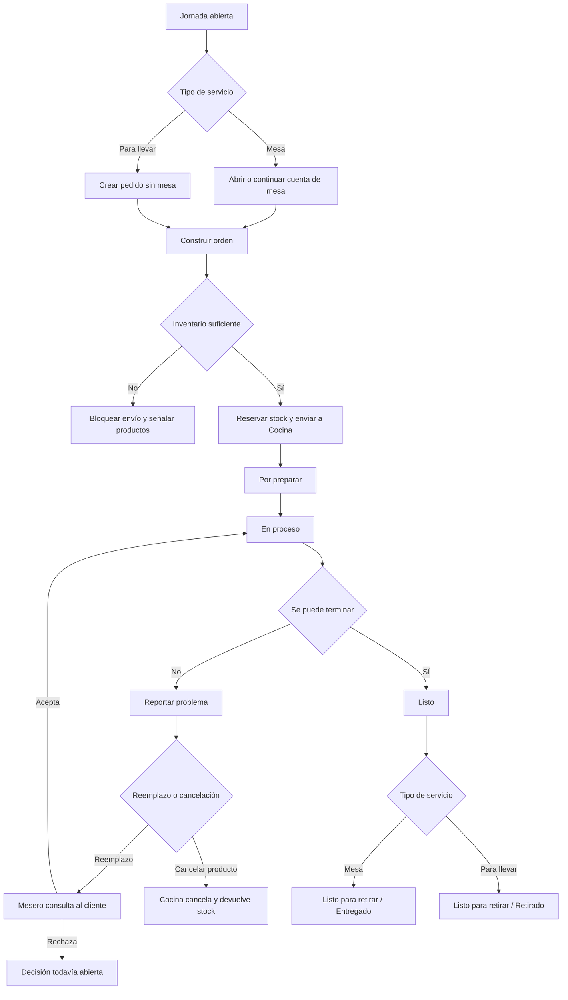
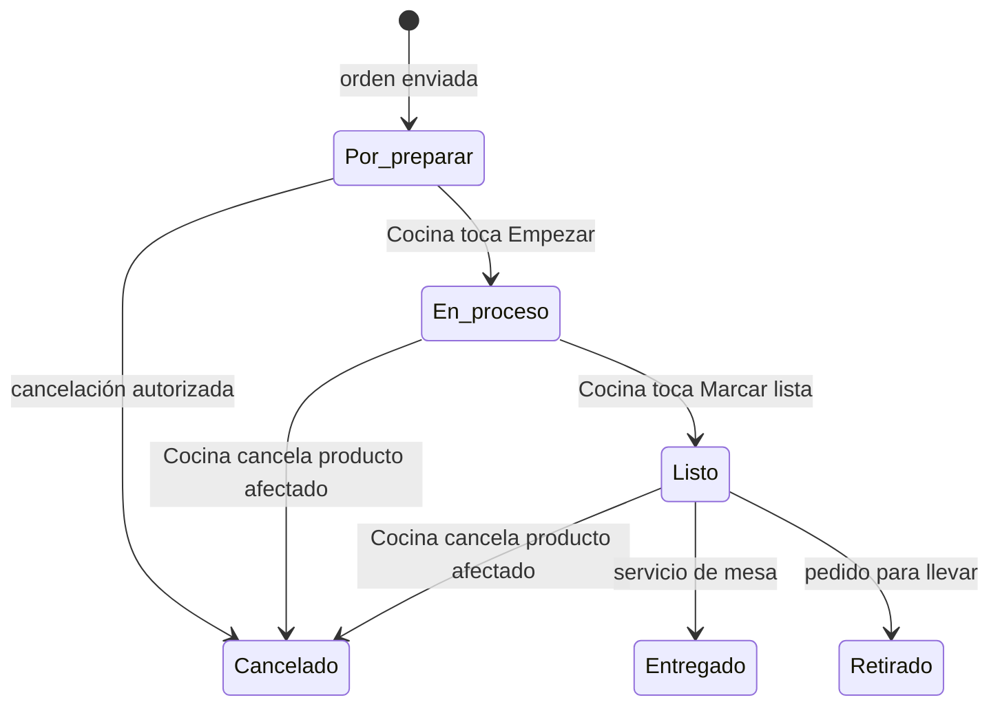

# Flujos y reglas condicionales del sistema

Fecha: 10 de septiembre de 2026

Estado: especificación de trabajo implementada y cubierta por pruebas. Sigue siendo el borrador base del futuro `Manual funcional y de operación del sistema`, que se publicará para compradores únicamente después de la auditoría final de la versión entregable y con capturas reales vigentes.

## Propósito

Este documento debe declarar formalmente todas las capacidades y limitaciones del sistema. Describe qué debe hacer y qué no debe hacer ante cada situación operativa acordada, convirtiendo las decisiones en condiciones, acciones, permisos y resultados verificables.

No reemplaza el código ni afirma que todas estas reglas ya estén implementadas. La fuente de alcance y prioridades sigue siendo `docs/AGENDA_PRODUCTO_UI_2026-09-10.md`.

## Alcance

Incluye:

- jornada operativa;
- mesas y cuentas;
- órdenes de mesa;
- pedidos para llevar;
- validación de inventario;
- Cocina;
- incidencias y reemplazos;
- cancelaciones y devolución de stock;
- entrega de platos;
- precuenta y correcciones;
- permisos y trazabilidad.

No incluye por ahora:

- delivery de plataformas;
- procesamiento de pagos;
- comprobantes de pago;
- correcciones de cuentas después de cerrarlas;
- Barra como estación obligatoria;
- reasignación de platos preparados entre órdenes.

## Actores

| Actor | Responsabilidad principal |
| --- | --- |
| Mesero | Abre mesas, crea órdenes, corrige antes de preparación, atiende incidencias y confirma entregas. |
| Cocina | Prepara órdenes, informa problemas, propone reemplazos y cancela productos que ya entraron a preparación. |
| Administración | Configura el sistema y autoriza operaciones excepcionales o de alto impacto. |
| Encargado de turno | Sustituye a Administración únicamente en las acciones que se le asignen explícitamente durante el turno. |
| Sistema | Valida inventario, controla transiciones, actualiza stock, registra auditoría y evita acciones incompatibles. |

## Reglas que nunca deben romperse

1. Ningún producto se envía a Cocina sin una segunda validación de inventario.
2. Una acción visible como deshabilitada también debe estar bloqueada en el backend.
3. Un derecho genérico como `avanzado` no sustituye un permiso explícito por acción.
4. Una cancelación nunca elimina el historial.
5. El mismo movimiento de inventario no puede aplicarse dos veces.
6. El detalle escrito es opcional; el motivo rápido requerido se elige con un toque.
7. Cocina puede cancelar un producto afectado, no una cuenta completa.
8. Una cuenta cerrada no se modifica en esta fase.
9. El sistema calcula y gestiona la cuenta, pero no procesa el pago ni emite comprobantes de pago.
10. Los reintentos de red no deben crear órdenes, correcciones o devoluciones duplicadas.

## Mapa general

## 1. Jornada operativa

| Si ocurre | Condición adicional | Entonces | Resultado |
| --- | --- | --- | --- |
| Un usuario intenta operar | Hay jornada abierta | Se permite continuar según sus permisos. | Toda cuenta, orden, comanda e incidencia queda asociada a esa jornada. |
| Un usuario intenta operar | No hay jornada abierta | Se bloquea la operación que genere movimientos. | Se solicita abrir una jornada. |
| Administración intenta cerrar la jornada | Hay tareas activas en Cocina | Se bloquea el cierre. | Se informa cuántas tareas faltan. |
| Administración intenta cerrar la jornada | Hay incidencias pendientes | Se bloquea el cierre. | Se informa cuántas decisiones faltan. |
| Administración intenta cerrar la jornada | No hay cuentas, Cocina ni incidencias pendientes | Se permite cerrar. | Se conserva resumen, responsables, horas y respaldo. |

## 2. Inicio del servicio

### 2.1 Pedido de mesa

| Si ocurre | Condición | Entonces |
| --- | --- | --- |
| El mesero toca una mesa libre | La jornada está abierta | Se abre una cuenta vinculada a esa mesa. |
| El mesero toca una mesa ocupada | Tiene una cuenta activa | Se abre la cuenta existente; no se crea otra. |
| El mesero intenta abrir otra cuenta en la misma mesa | Ya existe una cuenta abierta o con precuenta vigente | Se reutiliza la cuenta existente o se bloquea la duplicación. |
| El restaurante tiene un solo salón | No hay áreas adicionales configuradas | No se muestran controles de áreas sin función. |

### 2.2 Pedido para llevar

| Si ocurre | Condición | Entonces |
| --- | --- | --- |
| El mesero crea una nueva orden | El cliente no usará mesa | Selecciona `Para llevar` en el mismo lugar donde normalmente seleccionaría la mesa. |
| Se crea el pedido | Siempre | El sistema asigna un número correlativo automático. |
| El mesero conoce el nombre | El cliente desea darlo | Puede añadirlo; el nombre es opcional. |
| El nombre queda vacío | Siempre | El número identifica el pedido por sí solo. |
| Se envía a Cocina | Inventario válido | Aparece en el tablero normal con `Para llevar` en lugar de mesa y una señal visible de que debe empacarse. |
| Se ordena la cola | No hay configuración especial | Tiene la misma prioridad que una mesa. |
| Administración cambia la prioridad | Existe la opción configurada | Se aplica la prioridad definida a los nuevos pedidos para llevar. |
| Cocina termina | Siempre | Pasa a `Listo para retirar`. |
| El cliente recibe el pedido | Un usuario confirma el retiro | Pasa a `Retirado`. |
| Se intenta emitir precuenta | Es para llevar | No se ofrece esa acción. |
| Se intenta procesar o registrar un pago | Es para llevar | El sistema no lo hace; el pago ocurre fuera del sistema al ordenar. |

## 3. Construcción y envío de una orden

| Si ocurre | Condición | Entonces | Resultado |
| --- | --- | --- | --- |
| El mesero añade un producto | Hay stock aparente | Se añade al borrador. | Todavía no garantiza el envío. |
| El mesero añade un producto | Está agotado según inventario | No se permite añadir o queda claramente bloqueado. | Se muestra `Agotado`. |
| El mesero toca enviar | Todas las recetas tienen disponibilidad | El backend valida otra vez, reserva el stock y crea la salida a Cocina. | La orden queda enviada una sola vez. |
| El mesero toca enviar | Falta cualquier ingrediente | Se bloquea toda la operación. | Se indican los productos que debe quitar o reemplazar; no se envía una orden incompleta. |
| La red reintenta el envío | La misma operación ya fue aceptada | Se devuelve el resultado anterior. | No se crea una segunda orden. |
| La orden contiene varios productos | Se envía correctamente | Cocina recibe una tarjeta por orden completa. | Cada producto conserva su estado para incidencias. |

## 4. Flujo de Cocina

### 4.1 Estados

### 4.2 Reglas del tablero

| Si ocurre | Condición | Entonces |
| --- | --- | --- |
| Entra una nueva orden | Fue validada y enviada | Aparece en `Por preparar`. |
| Cocina toca `Empezar` | La orden está `Por preparar` y no tiene incidencia bloqueante | Pasa a `En proceso`. |
| Cocina toca `Marcar lista` | La orden está `En proceso` y no tiene productos sin resolver | Pasa a `Listo`. |
| Una orden pasa a `Listo` | Siempre | Sale de las columnas activas y aumenta el contador de `Órdenes listas`. |
| Cocina abre una orden | Está activa | Ve número, mesa o `Para llevar`, tiempo y productos. |
| Cocina intenta cerrar una orden | Tiene incidencia pendiente | Se bloquea hasta resolverla. |

El tablero activo tiene solo dos columnas: `Por preparar` y `En proceso`. `Órdenes listas` es un acceso superior con contador.

## 5. Problemas durante la preparación

### 5.1 Reporte

| Si ocurre | Condición | Entonces |
| --- | --- | --- |
| Cocina detecta que no puede terminar | El producto está `En proceso` o `Listo` | Abre `Reportar problema`. |
| Cocina reporta el problema | Siempre | Selecciona producto y motivo rápido; el detalle escrito es opcional. |
| Hay una alternativa | Cocina puede prepararla | Propone un reemplazo. |
| No hay alternativa | El producto no se puede completar | Cocina usa `Cancelar producto y devolver stock`. |

### 5.2 Reemplazo

| Si ocurre | Entonces | Quién actúa | Resultado |
| --- | --- | --- | --- |
| Cocina propone reemplazo | Se crea una incidencia `Por responder`. | Cocina | La preparación afectada queda bloqueada. |
| El mesero recibe la propuesta | La ve en `Incidencias` y dentro de la orden. | Mesero | Consulta al cliente. |
| El cliente acepta | El mesero confirma. | Mesero | Cocina recibe la confirmación y continúa con el reemplazo. |
| El cliente rechaza | El mesero rechaza la sugerencia. | Mesero | Cocina recibe la respuesta y decide si cancela el producto o propone otra alternativa; el rechazo no cancela nada automáticamente. |
| El reemplazo tiene otro precio | No hay regla final aprobada. | — | Debe definirse cómo mostrar y aplicar la diferencia. |

### 5.3 Cancelación iniciada por Cocina

| Si ocurre | Condición | Entonces |
| --- | --- | --- |
| Cocina cancela el producto afectado | Está `En proceso`, `Listo` o ya fue preparado | El producto se retira de la cuenta y se revierte la receta completa. |
| Cocina cancela el producto | Siempre | Se registra orden, producto, usuario, hora y motivo. |
| Cocina intenta cancelar otro producto | No es el producto reportado | Se bloquea. |
| Cocina intenta cancelar la cuenta completa | Siempre | Se bloquea. |
| Se completa la cancelación | Siempre | El mesero recibe una actualización para informar al cliente. |
| El mesero abre la actualización | Ya fue resuelta por Cocina | Solo reconoce la información; no vuelve a cancelar. |

La regla aprobada devuelve la receta completa incluso si el plato ya estaba preparado. El sistema no pregunta por merma, reutilización ni reasignación.

## 6. Cancelación y edición según etapa

| Estado del producto | Quién puede corregir o cancelar | Requisitos | Efecto |
| --- | --- | --- | --- |
| Borrador, aún no enviado | Mesero | Sesión válida. | Cambia cantidad o elimina sin afectar Cocina. |
| `Por preparar` | Mesero | PIN propio y motivo rápido. | Cancela el producto y libera la reserva. |
| No requiere preparación | Mesero, mientras la cuenta siga abierta | PIN propio y motivo rápido. | Cancela y devuelve el stock correspondiente. |
| `En proceso` | Cocina | Motivo rápido. | Cancela solo el producto afectado y devuelve la receta completa. |
| `Listo` o preparado | Cocina | Motivo rápido. | Cancela solo el producto afectado y devuelve la receta completa. |
| Orden o cuenta completa ya iniciada | Administración o encargado de turno designado | PIN y motivo. | Anulación completa con historial. |
| Cuenta cerrada | Nadie en esta fase | — | Solo consulta; no se modifica. |
| Pedido para llevar ya enviado y pagado fuera del sistema | Administración o encargado de turno | Autorización y motivo. | Cancelación excepcional de la orden; el sistema no procesa devolución de dinero. |

Si no está disponible Administración ni el encargado para una anulación completa, el mesero registra una incidencia pendiente. Hasta que se autorice, no se elimina historial ni se altera inventario.

## 7. Bandeja de incidencias del mesero

| Si ocurre | Clasificación | Acción del mesero |
| --- | --- | --- |
| Cocina propone reemplazo | `Por responder` | Consultar al cliente y aceptar o rechazar. |
| Cocina ya canceló un producto | `Actualizaciones` | Reconocer e informar al cliente. |
| El producto pasa normalmente a `En proceso` | No es incidencia | No aparece en la bandeja. |
| El producto pasa normalmente a `Listo` | No es incidencia | Se muestra en el flujo de entrega, no en incidencias. |
| La incidencia se resuelve | Historial | Sale de pendientes pero conserva actores, tiempos y decisión. |

La bandeja debe mostrar contador, mesa o `Para llevar`, producto, motivo, propuesta y estado de respuesta.

## 8. Entrega de platos

### 8.1 Servicio de mesa

| Si ocurre | Condición | Entonces |
| --- | --- | --- |
| Cocina marca `Listo` | Pedido de mesa | El mesero ve `Listo para retirar`. |
| El mesero entrega | Siempre | Marca `Entregado`. |
| El mesero no confirma | Está activo el check recomendado | A los 30 minutos pasa automáticamente a `Entregado`. |
| Hay una incidencia pendiente | Corre el temporizador automático | El temporizador se pausa. |
| Se resuelve la incidencia | El check sigue activo | El temporizador puede continuar según la regla técnica que se defina. |
| La entrega cambia de estado | Manual o automática | Se registra el origen de la transición. |

### 8.2 Pedido para llevar

| Si ocurre | Entonces |
| --- | --- |
| Cocina termina | Pasa a `Listo para retirar`. |
| El cliente retira | Un usuario lo marca `Retirado`. |
| Transcurren 30 minutos sin retiro | No se marca automáticamente como retirado. |

La automatización de 30 minutos pertenece a la entrega en mesa. No se extiende a `Retirado` sin una decisión futura explícita.

## 9. Precuenta y correcciones

### 9.1 Emisión

| Si ocurre | Condición | Entonces |
| --- | --- | --- |
| El cliente solicita revisar la cuenta | La mesa sigue abierta | El mesero emite la precuenta. |
| Se intenta cerrar la cuenta | No hay precuenta vigente | Se bloquea. |
| Se intenta emitir precuenta | Es pedido para llevar | No se ofrece; este flujo no usa precuenta. |

### 9.2 Corrección antes de cerrar

| Si ocurre | Condición | Entonces |
| --- | --- | --- |
| Se detecta cantidad de más | El producto no fue preparado o no requiere preparación | El mesero corrige con PIN y motivo rápido. |
| Se detecta producto duplicado | La mesa sigue abierta | El mesero corrige con PIN y motivo rápido. |
| Se detecta producto equivocado | La mesa sigue abierta | Se usa `Reemplazar producto`, no un cambio silencioso de cantidad. |
| La corrección afecta algo `En proceso` o `Listo` | Siempre | Cocina cancela primero el producto afectado. |
| Cocina completa la cancelación | Siempre | El mesero recibe la actualización y puede emitir una nueva precuenta. |
| Se confirma una corrección | Siempre | La precuenta anterior pierde vigencia y se genera una nueva. |
| Se abre el formulario | Siempre | Muestra producto, cantidad nueva, stock devuelto y nuevo total. |

Motivos rápidos propuestos:

- `Agregado y no entregado`;
- `Cantidad registrada de más`;
- `Producto duplicado`;
- `Devuelto por el cliente`;
- `Otro`.

El campo `Detalle` es opcional.

### 9.3 Cuenta cerrada

| Si ocurre | Entonces |
| --- | --- |
| Se intenta editar una cuenta cerrada | Se bloquea. |
| Se detecta un error después del cierre | Queda fuera de esta fase. |
| Se requiere consultar la cuenta | Se permite solo lectura. |

## 10. Inventario

| Si ocurre | Entonces |
| --- | --- |
| Un producto se envía a Cocina | Se registra o reserva el consumo según la política activa. |
| El mesero cancela antes de preparar | Se libera la reserva una sola vez. |
| Cocina cancela durante o después de preparar | Se revierte la receta completa una sola vez. |
| La misma solicitud se reintenta | No se duplica el movimiento. |
| El stock llega a cero | El material se muestra `Sin stock` y bloquea productos dependientes. |
| El stock cruza el umbral bajo | Se muestra `Poco stock`. |
| Hay disponibilidad suficiente | Se muestra `Disponible`. |
| La pestaña está abierta | El inventario se actualiza automáticamente. |
| La pestaña está oculta o cerrada | No se exige actualización continua. |

Orden visual al ordenar por estado:

1. `Sin stock`.
2. `Poco stock`.
3. `Disponible`.

La vista se actualiza cada 15 segundos mientras la pestaña está visible. `Poco stock` usa por ahora una regla común: 20 % o menos de la existencia física, con un mínimo de 2 unidades.

## 11. Permisos

| Acción | Mesero | Cocina | Encargado de turno | Administración |
| --- | :---: | :---: | :---: | :---: |
| Crear orden de mesa | Sí | No | Según roles asignados | Sí |
| Crear pedido para llevar | Sí | No | Según roles asignados | Sí |
| Cancelar producto `Por preparar` | Sí, con PIN | No | Sí | Sí |
| Cancelar producto `En proceso` o `Listo` | No | Sí, solo afectado | Sí | Sí |
| Proponer reemplazo | No | Sí | Sí | Sí |
| Responder reemplazo al cliente | Sí | No | Sí | Sí |
| Anular orden o cuenta completa iniciada | No | No | Sí, si está designado | Sí |
| Corregir precuenta abierta | Sí, con PIN | No | Sí | Sí |
| Editar cuenta cerrada | No | No | No | No en esta fase |
| Cambiar configuración | No | No | Solo si recibe ese permiso | Sí |

## 12. Trazabilidad mínima

Cada operación sensible debe registrar:

- jornada;
- fecha y hora;
- usuario y rol efectivo;
- cuenta y orden;
- producto y cantidad, cuando aplique;
- estado anterior y nuevo;
- motivo rápido;
- detalle opcional;
- movimiento de inventario asociado;
- origen manual o automático;
- identificador de la operación para impedir duplicados.

Nunca se borra físicamente un registro operativo para ocultar una corrección.

## 13. Errores y recuperación

| Si ocurre | Entonces |
| --- | --- |
| Falla la red antes de confirmar | Se informa que no hay confirmación y se permite reintentar con la misma clave de operación. |
| Falla la red después de que el servidor confirmó | El reintento devuelve el resultado existente y no duplica datos. |
| El stock cambió entre selección y envío | Se rechaza el envío y se muestran los productos afectados. |
| Otro usuario resolvió la incidencia | Se refresca el estado y se impide responderla dos veces. |
| Otro usuario cambió la etapa de Cocina | Se actualiza la tarjeta y se bloquea la transición obsoleta. |
| El PIN es incorrecto | Se rechaza la acción sensible sin cambiar datos. |
| La sesión perdió el permiso | El backend rechaza la acción aunque el botón siga visible por datos desactualizados. |
| Ocurre un error técnico | Se muestra un mensaje humano con acción de recuperación; no se expone `Failed to fetch`. |

## 14. Decisiones pendientes que bloquean casos completos

1. Cómo se presenta al mesero la diferencia de precio de un reemplazo antes de confirmarlo; el cálculo de la cuenta ya usa el precio del producto sustituto.
2. Si en el futuro el umbral de `Poco stock` debe poder configurarse por material.
3. Lista final de motivos rápidos para Mesero y Cocina.
4. Si la entrega automática recomendada viene activada por defecto.
5. Qué ocurre con el temporizador después de resolver una incidencia: reiniciar 30 minutos o continuar con el tiempo restante.
6. Intervalo de actualización automática de Inventario.
7. Umbral global o individual para `Poco stock`.
8. Si las áreas adicionales del salón son una configuración opcional.
9. Alcance futuro del módulo de Barra.

## 15. Escenarios de aceptación prioritarios

1. Una orden con un ingrediente agotado no puede enviarse.
2. Dos toques o un reintento de red crean una sola orden.
3. El mesero cancela un producto `Por preparar`; la reserva vuelve una sola vez.
4. El mesero intenta cancelar algo `En proceso`; el backend lo rechaza.
5. Cocina cancela el producto afectado `En proceso`; la receta vuelve una sola vez y la cuenta se actualiza.
6. Cocina intenta anular la cuenta completa; el backend lo rechaza.
7. Cocina propone reemplazo; el mesero lo ve con contador y Cocina espera la respuesta.
8. Una incidencia pendiente impide marcar lista y pausa la entrega automática.
9. Una entrega manual y una automática dejan trazabilidad diferente.
10. Una precuenta corregida invalida la anterior y muestra el nuevo total.
11. Una cuenta cerrada no admite edición por ningún rol.
12. Un pedido para llevar se crea sin mesa, recibe número, acepta nombre opcional y aparece rotulado en Cocina.
13. El pedido para llevar pasa de `Listo para retirar` a `Retirado` solo mediante confirmación.
14. La cancelación excepcional de un pedido para llevar requiere Administración o encargado de turno.
15. Cerrar la jornada falla mientras existan cuentas, tareas de Cocina o incidencias pendientes.

## Criterio para considerar una regla terminada

Una regla está terminada solamente cuando:

1. existe validación en backend;
2. la interfaz muestra únicamente las acciones permitidas;
3. hay prueba del caso permitido y del caso rechazado;
4. el inventario y el historial quedan consistentes;
5. los reintentos no duplican efectos;
6. la pantalla fue revisada en teléfono, tablet y monitor cuando corresponda.
