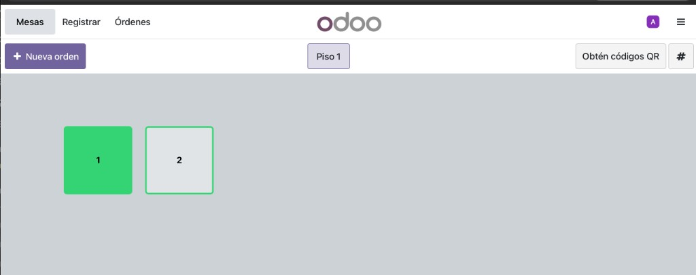

# Mapa de pantallas

Una captura por pantalla. Para agregar la siguiente: guarda `pantallas/NN-nombre.png` y pega un bloque igual al de **2**.

Cabecera común (todas las de sala): tabs a la izquierda · **marca del local al centro** · avatar + menú a la derecha.

Marca: texto (`nombre_restaurante`) **o** imagen (`logo.png`). No va el wordmark de Odoo.

---

## Flujo

```
1 Login → 2 Mesas → 3 Pedido ─┬─ 4 PIN enviar
                              ├─ 5 PIN precuenta
                              └─ 6 PIN caja → 2
         2 ── Órdenes (O) ──► 7
         2 ── + Nueva orden (N) / # mesa / dígitos ──► 3
```

---

## 1. Login

estado: hecho (nuestra app) · captura: pendiente

---

## 2. Mesas

estado: en la app (chrome Odoo, sin Registrar ni QR)  
archivo: `ui/src/pantallas/Plano.tsx`



| Zona | Qué es |
| --- | --- |
| Tabs | **Mesas** (M) · **Órdenes** (O). Icono cuenta (cerrar sesión) · icono menú (navegar). |

| Centro | `{nombre_local}` (texto; logo después) |
| Barra | `+ Nueva orden` (N) · piso · `#` elegir mesa por número · Últimos / Atrasados (on/off) |
| Lienzo | mesas ≥ 64px; toque o número + Enter |
| Abajo | barras opcionales: últimos 5 · los más atrasados (color por espera) |

QR no va. `#` abre el teclado/campo de número de mesa.

Teclado: `M` Mesas · `O` Órdenes · `N` nueva · `#` o dígitos = mesa · Enter abre · Esc cierra.

Espera: verde menos de 8 min · ámbar 8–14 · naranja 15–24 · rojo 25 o más.

Tocar mesa libre o **+ Nueva orden** → **3**. Tocar mesa con pedido → **3** de esa mesa. Chip de barra → **3**.

---

## 3. Pedido

estado: hecho (layout nuestro) · captura Odoo: pendiente

---

## 4. PIN enviar · 5. PIN precuenta · 6. PIN caja

4 hecho · 5 y 6 spec. Misma pad; cambia el título.

---

## 7. Órdenes

estado: hecho como “Pedidos” · captura: pendiente

---

## 8. Complementos · 9. KDS · 10–16 spec

Sin captura. No bloquean el circuito 1→2→3.

---

## Plantilla (siguiente pantalla)

```markdown
## N. Nombre

estado: …


Notas (3 líneas máx).
```
